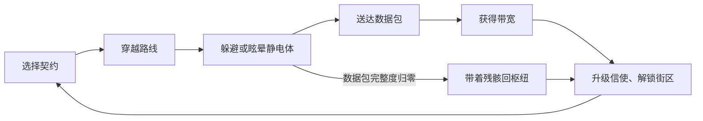

# 《信号漂流》设计文档

## 1. 概念

《信号漂流》是一款 2D 俯视角 Roguelite 送件游戏。玩家扮演一名信使无人机，在记忆网络正在崩坏、被“静电体”侵蚀的淹水城市中，把实体数据包从中继塔送往另一座中继塔。

每成功送达一份数据包，城市就恢复一部分记忆；每一轮都会进入更危险、更被污染的街区。玩家不是战士：打不过静电体，所以路线规划、冲刺时机和信号脉冲的使用比战斗更重要。

## 2. 玩家动作

| 动作 | 说明 |
| --- | --- |
| 移动 | 方向键或 WASD，在街道网格中穿行 |
| 冲刺 | 短距离高速移动，获得短暂无敌，需要充能 |
| 信号脉冲 | 释放冲击波，眩晕周围静电体，有冷却时间 |
| 取包 / 交包 | 从起点中继塔携带数据包，送达目的地中继塔 |
| 修复节点 | 顺路经过修复节点可恢复部分数据包完整度 |
| 升级 | 回枢纽后用带宽购买信使强化 |

## 3. 核心循环



- 单次送货：45 到 90 秒
- 一局完整游戏：6 到 10 分钟
- 失败是温和的：丢包后仍能带回少量残骸

## 4. 契约系统

枢纽提供三档契约：

| 契约 | 难度 | 特点 | 报酬 |
| --- | --- | --- | --- |
| 近区快递 | 平稳 | 静电体少、路线短 | 低 |
| 中区急件 | 危险 | 静电体更多、路线更长 | 中 |
| 深区绝密 | 致命 | 静电体密集、路线跨越整座城 | 高 |

每次契约由固定种子生成街道网格、静电体巡逻路线和修复节点位置，保证同一契约可复现，也方便后续加入每日挑战。

## 5. 失败与结算

- 静电体触碰会侵蚀数据包，完整度归零即任务失败
- 数据包会随时间缓慢衰减，逼迫玩家尽快行动
- 成功送达：获得基础报酬加剩余完整度奖励
- 失败：获得少量残骸报酬
- 连续成功累积连胜，失败清零；最高连胜计入存档

## 6. 进度系统

### 带宽升级

| 升级 | 效果 |
| --- | --- |
| 推进器速度 | 提升移动速度 |
| 冲刺充能 | 增加冲刺充能上限 |
| 脉冲半径 | 扩大眩晕范围 |
| 数据包护甲 | 降低受损值并减缓完整度衰减 |

### 记忆碎片

每送达一次数据包，解锁一段城市记忆。原型阶段以剧情文本为主，后续可给记忆碎片附加被动能力。

## 7. 技术方案

- 引擎：Phaser 3
- 语言与构建：TypeScript + Vite
- 界面：DOM 覆盖层实现 HUD、菜单、升级终端
- 状态：模拟逻辑与渲染分离，可存档数据单独维护
- 存档：浏览器本地存储，只保存带宽、升级、连胜、送达次数等数据

## 8. 模块结构

```text
src/
  game/
    types.ts          # 共享类型
    save.ts           # 存档与升级定义
    contracts.ts      # 契约数据
    world.ts          # 街道网格与障碍生成
    simulation.ts     # 模拟逻辑：移动、碰撞、静电体、结算
    input.ts          # 输入动作映射
  phaser/
    textures.ts       # 程序生成美术贴图
    scenes/
      BootScene.ts    # 初始化贴图与资源
      HubScene.ts     # 枢纽背景
      RunScene.ts     # 跑图场景
  ui/
    hub.ts            # 契约板、升级终端、记忆档案
    hud.ts            # 局内 HUD
```

## 9. 界面设计

- 局内 HUD：目标提示、数据包完整度、冲刺充能、脉冲冷却
- 画面中央保持干净，不遮挡街道
- 桌面端：键盘操作，HUD 贴边排列
- 移动端：虚拟摇杆加两个动作按钮，HUD 压缩为边缘布局
- 暂停与设置折叠次要面板

## 10. 美术资源

原型阶段全部使用程序生成贴图：

- 信使无人机
- 2 到 3 种静电体变体
- 中继塔、数据包、修复节点
- 可平铺的街道与建筑块
- 冲刺拖尾、脉冲冲击波等粒子特效

色彩基调：深色洪水街道、青绿色水面、琥珀色信号、红色静电、青色修复节点。

## 11. 测试方案

- 启动冒烟：进入枢纽，契约板正常显示
- 输入冒烟：移动、冲刺、脉冲都能触发状态变化
- 流程冒烟：接受契约、送达成功、失败重来、返回枢纽
- 存档冒烟：刷新页面后带宽与升级保留
- 视觉检查：桌面与手机视口截图，确认 HUD 不遮挡街道
- 性能检查：大量静电体同屏时保持流畅

## 12. 原型范围（v0.1）

- 三档契约可选
- 程序生成街道网格
- 移动、冲刺、脉冲三项核心动作
- 静电体巡逻与追击
- 数据包完整度、修复节点、送达与失败结算
- 带宽升级与本地存档
- 记忆档案文本

暂不包含：音频、剧情演出、每日挑战、更多街区与敌人变体。

## 13. 验收标准

1. 玩家可以在 30 秒内完成选契约并进入跑图
2. 一次完整送件可以在 90 秒内完成
3. 成功送达可获得带宽，失败可获得少量残骸
4. 带宽可以购买升级，升级效果能实际影响跑图表现
5. 刷新页面后进度保留
6. 桌面和手机视口下 HUD 均不遮挡主要街道
